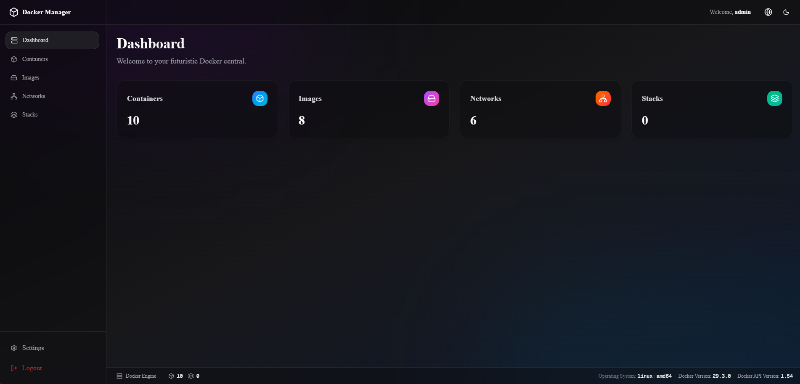

# 🐳 Docker Manager ウェブインターフェース

[Deutsch](README.de.md) | [English](README.md) | [Español](README.es.md) | [Français](README.fr.md) | [Українська](README.uk.md) | [Русский](README.ru.md) | [日本語](README.ja.md) | [中文](README.zh.md)

ローカルの Docker 環境を管理するための、パワフルでモダン、かつ未来志向のウェブインターフェース。Next.js、Tailwind CSS（Glassmorphism デザイン）、Shadcn UI を使用して構築されています。


(他の画像は [docs](docs/) にあります)

## ✨ 機能

- **未来的な UI:** 「Glassmorphism」スタイルで完全にデザインされており、ダークモードとライトモードの両方をサポート。流動的なメッシュグラデーションを背景に採用しています。
- **🌍 多言語対応 (i18n):** インターフェースは **8言語** に完全対応: 日本語、英語、ドイツ語、スペイン語、フランス語、ウクライナ語、ロシア語、中国語（簡体字）。
- **🔐 統合認証:** 保護されたアクセスエリア。アプリケーションは SQLite データベースを自動生成し、（変更可能な）ユーザー名とパスワードによるログインが必要です。デフォルトログイン: `admin` / `admin`。
- **📦 コンテナ管理:**
  - すべての実行中および停止中コンテナの概要表示。
  - コンテナの起動、停止、再起動、削除。
  - **リアルタイムターミナル (xterm.js):** TTY カラーサポート付きのインタラクティブシェルをブラウザで直接開けます。
  - **ライブログ:** コンテナの出力をリアルタイムで確認。
- **💿 イメージ管理:**
  - すべてのローカル Docker イメージの一覧表示。
  - 個別イメージの削除。
  - スマートクリーンアップ: ダングリングイメージや未使用イメージをワンクリックで削除。
- **🌐 ネットワーク管理:**
  - すべての Docker ネットワークの概要。
  - 新しいネットワークの作成（IPv4/IPv6 サブネット/ゲートウェイ設定のオプション対応）。
  - 未使用ネットワークの削除。
- **🥞 スタック対応 (Docker Compose):**
  - `docker-compose.yml` ファイル用の統合コードエディタ (Monaco)。
  - `.env` 変数を並行管理するための専用タブ。
  - ブラウザから直接スタックをデプロイ (`docker compose up -d`) または停止 (`docker compose down`)。

---

## 🚀 インストール & 起動

このアプリケーションは公式に **Docker 対応** であり、必要なすべてのもの（Alpine Linux、Docker CLI、Node.js サーバー）が含まれています。ホストシステムに Node.js をインストールする必要すらありません！

### オプション 1: ビルド済み Docker イメージ（最も簡単 – 推奨）

GitHub Container Registry から最新イメージを直接プルします：

```bash
docker pull ghcr.io/codenotiz/docker-manager:latest
```

または、付属の **`docker-compose.yml`** を使用すると、イメージを自動的にダウンロードして起動します：

```bash
# 1. docker-compose.yml をダウンロード（またはリポジトリをクローン）
# 2. バックグラウンドでコンテナを起動
docker compose up -d
```
アプリは **`http://localhost:3000`** でアクセス可能になります。

### オプション 2: ソースから Docker Compose でビルド

付属の `docker-compose.build.yml` を使用してイメージをローカルでビルドします。先にリポジトリをクローンする必要があります。

```bash
# 1. リポジトリをクローン
git clone https://github.com/CodeNotiz/docker-manager.git
cd docker-manager

# 2. バックグラウンドでコンテナをビルドして起動
docker compose -f docker-compose.build.yml up -d --build
```
アプリは **`http://localhost:3000`** でアクセス可能になります。

### オプション 3: Node.js 経由でのクラシックセットアップ（開発用）

前提条件: Node.js (v18+) と Docker がホストにインストールされていること。

```bash
npm install
npm run dev
```
開発サーバーはポート 3000 で起動します。*ヒント: 初回起動時に、`/data` フォルダと SQLite データベース `docker-manager.db` がバックグラウンドで自動的に作成されます。*

---

## ⚙️ 設定

### 環境変数

| 変数 | デフォルト | 説明 |
|---|---|---|
| `LOG_LEVEL` | `INFO` | サーバー側のログ出力の詳細レベルを制御します。 |
| `PORT` | `3000` | Node.jsサーバーがリッスンするポート。 |
| `HOST` | `0.0.0.0` | サーバーがバインドするネットワークインターフェース。 |
| `COOKIE_SECURE` | `false` | HTTPS/リバースプロキシの背後で実行されている場合にのみ `true` に設定します。 |

### ログレベル (`LOG_LEVEL`)

| 値 | 説明 |
|---|---|
| `DEBUG` | ソケット接続やミドルウェアリダイレクトを含む全メッセージ |
| `INFO` | 標準 – サーバー起動、DB初期化、エラー *(デフォルト)* |
| `WARN` | 警告とエラーのみ（例：期限切れトークン） |
| `ERROR` | エラーのみ |
| `SILENT` | 出力なし |

**`docker-compose.yml` での例：**
```yaml
environment:
  - LOG_LEVEL=DEBUG
```

**ローカル開発での例：**
```bash
LOG_LEVEL=DEBUG npm run dev
```

---

## 🛡️ 認証（ログイン）

アプリケーションは Edge Middleware によって保護されています。有効な JWT クッキーがなければ、ダッシュボードや API へのアクセスはブロックされます。

- **デフォルトユーザー名:** `admin`
- **デフォルトパスワード:** `admin`

*注意: 初回ログイン後はこれらの認証情報を変更することを強くお勧めします！*

### 認証情報の変更
サイドバー（左下）の **「設定」** をクリックしてください。そこで新しいユーザー名および/またはパスワードを設定できます。確認のために現在のパスワード（初期値は `admin`）の入力が必要です。

---

## 📁 サーバーのフォルダ構造

コードに加えて、サーバーは実行時にルートフォルダ内に 2 つの重要なディレクトリを作成します:

- `data/docker-manager.db`: 認証情報を保存します（パスワードは `bcrypt` によって暗号化・ハッシュ化されます）。
- `stacks_data/`: UI で Docker Compose スタックを作成すると、ここにサブフォルダが作成されます。その中に対応する `docker-compose.yml` と場合によっては `.env` ファイルが格納されます。必要に応じてこれらのファイルを UI 外で編集することも可能です。

---

## 🛠️ 使用技術スタック

- **フロントエンド:** Next.js (App Router), React, Tailwind CSS
- **コンポーネント:** Shadcn UI, Radix UI, Lucide Icons
- **ターミナル & エディタ:** xterm.js (PTY 用 WebSockets 含む), Monaco Editor (`@monaco-editor/react`)
- **バックエンド (API ルート):** Node.js `fs`, `child_process`, `dockerode` (Docker API アダプター)
- **認証:** `jose` (JWT), `bcrypt`, `sqlite` / `sqlite3`

---

## 🤝 トラブルシューティング

* **ターミナルのカラーが表示されない?**
  バックエンドの PTY 作成時に環境が `TERM: 'xterm-256color'` に設定されていることを確認してください（コードに既に統合済み）。
* **Next.js のホスト警告（クロスオリジン）?**
  `allowedDevOrigins` パラメータは `next.config.ts` 内で設定されています。リモートサーバーでアプリを開発して IP 経由でアクセスする場合は、設定ファイルに対応する IP アドレスを追加してください。
* **`/var/run/docker.sock` へのアクセスが拒否される?**
  Node.js を実行するユーザーが `docker` グループのメンバーである必要があります。
  必要に応じて `sudo usermod -aG docker $USER` を実行し、再ログインしてください。

---

## 📬 連絡先 & 作者

**CodeNotiz** により開発
- ✉️ Email: info@codenotiz.de
- 🌐 GitHub: [github.com/CodeNotiz/docker-manager](https://github.com/CodeNotiz/docker-manager)

*より美しい Docker 体験のために ❤️ を込めて開発されました。*
