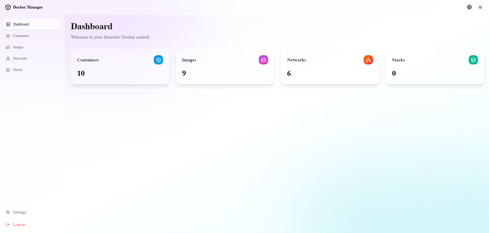

# 🐳 Веб-интерфейс Docker Manager

[Deutsch](README.de.md) | [English](README.md) | [Español](README.es.md) | [Français](README.fr.md) | [Українська](README.uk.md) | [Русский](README.ru.md) | [日本語](README.ja.md) | [中文](README.zh.md)

Мощный, современный и футуристический веб-интерфейс для управления вашей локальной средой Docker. Построен на Next.js, Tailwind CSS (дизайн Glassmorphism) и Shadcn UI.



## ✨ Возможности

- **Футуристичный UI:** Полностью выполнен в стиле «Glassmorphism», поддерживает тёмный и светлый режимы с плавными mesh-градиентами в качестве фона.
- **🌍 Многоязычность (i18n):** Интерфейс полностью доступен на **8 языках**: Русский, Английский, Немецкий, Испанский, Французский, Украинский, Японский и Китайский (Упрощённый).
- **🔐 Встроенная аутентификация:** Защищённая зона доступа. Приложение автоматически создаёт базу данных SQLite и требует входа с использованием (изменяемых) имени пользователя и пароля. Стандартный логин: `admin` / `admin`.
- **📦 Управление контейнерами:**
  - Обзор всех запущенных и остановленных контейнеров.
  - Запуск, остановка, перезапуск или удаление контейнеров.
  - **Терминал в реальном времени (xterm.js):** Откройте интерактивную оболочку прямо в браузере с поддержкой цветов TTY.
  - **Живые журналы:** Просмотр вывода контейнеров в режиме реального времени.
- **💿 Управление образами:**
  - Список всех локальных Docker-образов.
  - Удаление отдельных образов.
  - Интеллектуальная очистка: удаление зависших или неиспользуемых образов одним кликом.
- **🌐 Управление сетями:**
  - Обзор всех Docker-сетей.
  - Создание новых сетей (опциональная поддержка конфигурации подсети/шлюза IPv4 и IPv6).
  - Удаление неиспользуемых сетей.
- **🥞 Поддержка стеков (Docker Compose):**
  - Встроенный редактор кода (Monaco) для файлов `docker-compose.yml`.
  - Отдельная вкладка для параллельного ведения переменных `.env`.
  - Удобное развёртывание (`docker compose up -d`) или остановка (`docker compose down`) стеков прямо из браузера.

---

## 🚀 Установка и запуск

Приложение официально **готово к Docker** и включает всё необходимое (Alpine Linux, Docker CLI и Node.js-сервер). Вам даже не нужно устанавливать Node.js на хост-систему!

### Вариант 1: Готовый Docker-образ (Простейший способ – Рекомендуется)

Загрузите последний образ напрямую из GitHub Container Registry:

```bash
docker pull ghcr.io/codenotiz/docker-manager:latest
```

Или используйте включённый **`docker-compose.yml`**, который автоматически скачивает и запускает образ:

```bash
# 1. Скачать docker-compose.yml (или клонировать репозиторий)
# 2. Запустить контейнер в фоновом режиме
docker compose up -d
```
Приложение теперь доступно по адресу **`http://localhost:3000`**.

### Вариант 2: Сборка из исходного кода через Docker Compose

Используйте включённый `docker-compose.build.yml` для локальной сборки образа. Сначала необходимо клонировать репозиторий.

```bash
# 1. Клонировать репозиторий
git clone https://github.com/CodeNotiz/docker-manager.git
cd docker-manager

# 2. Собрать и запустить контейнер в фоновом режиме
docker compose -f docker-compose.build.yml up -d --build
```
Приложение теперь доступно по адресу **`http://localhost:3000`**.

### Вариант 3: Классическая настройка через Node.js (Для разработки)

Предварительные условия: Node.js (v18+) и Docker установлены на хосте.

```bash
npm install
npm run dev
```
Сервер разработки запустится на порту 3000. *Совет: при первом запуске в фоновом режиме автоматически создаётся папка `/data` вместе с базой данных SQLite `docker-manager.db`.*

---

## 🛡️ Аутентификация (Вход)

Приложение защищено Edge Middleware. Без действительного JWT-куки доступ к панели управления или API заблокирован.

- **Стандартное имя пользователя:** `admin`
- **Стандартный пароль:** `admin`

*Примечание: После первого входа настоятельно рекомендуется изменить эти данные!*

### Изменение учётных данных
Нажмите **«Настройки»** на боковой панели (внизу слева). Там можно задать новое имя пользователя и/или пароль. Для подтверждения необходимо ввести текущий пароль (изначально `admin`).

---

## 📁 Структура папок сервера

Помимо кода, сервер во время работы создаёт две важные директории в корневой папке:

- `data/docker-manager.db`: Хранит ваши учётные данные (пароли шифруются и хешируются через `bcrypt`).
- `stacks_data/`: Если вы создаёте Docker Compose Stack в UI, система создаёт здесь подпапку. В ней находятся соответствующий `docker-compose.yml` и возможный файл `.env`. При необходимости эти файлы можно редактировать и вне UI.

---

## 🛠️ Используемый стек технологий

- **Frontend:** Next.js (App Router), React, Tailwind CSS
- **Компоненты:** Shadcn UI, Radix UI, Lucide Icons
- **Терминал и редактор:** xterm.js (включая WebSockets для PTY), Monaco Editor (`@monaco-editor/react`)
- **Backend (API Routes):** Node.js `fs`, `child_process`, `dockerode` (Docker API Adapter)
- **Аутентификация:** `jose` (JWT), `bcrypt`, `sqlite` / `sqlite3`

---

## 🤝 Устранение неполадок

* **Отсутствуют цвета в терминале?**
  Убедитесь, что при создании PTY в бекенде среда настроена на `TERM: 'xterm-256color'` (уже интегрировано в код).
* **Предупреждения Host Next.js (Cross-Origin)?**
  Параметр `allowedDevOrigins` настроен в `next.config.ts`. Если вы разрабатываете приложение на удалённом сервере и получаете доступ к нему через IP, настройте соответствующие IP-адреса в конфигурации.
* **Доступ к `/var/run/docker.sock` запрещён?**
  Ваш исполняющий пользователь Node.js должен быть членом группы `docker`.
  При необходимости выполните `sudo usermod -aG docker $USER` и войдите снова.

---

## 📬 Контакт и автор

Разработано **CodeNotiz**
- ✉️ Email: info@codenotiz.de
- 🌐 GitHub: [github.com/CodeNotiz/docker-manager](https://github.com/CodeNotiz/docker-manager)

*Разработано с ❤️ для более приятного опыта работы с Docker.*
